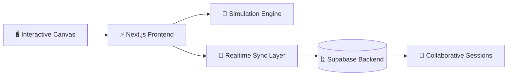

# 🏗 System Design Lab

<div align="center">


### Interactive Distributed Systems Simulation Platform

<p align="center">
An enterprise-grade system design visualization and architecture experimentation platform built for simulating scalable distributed systems, collaborative workflows, and infrastructure-level engineering concepts.
</p>

<br/>


<br/>


</div>


# 🧠 Platform Overview

System Design Lab is an interactive architecture simulation platform designed for experimenting with distributed systems, infrastructure scaling strategies, and real-time collaborative system design.

The platform combines:

- Interactive architecture modeling
- Real-time collaborative editing
- Distributed systems simulation
- SPOF & bottleneck visualization
- Stateful infrastructure workflows
- Enterprise-style architecture tooling

Built with the Next.js App Router ecosystem and Canvas-based rendering systems, the platform demonstrates how scalable engineering systems can be visualized and collaboratively designed in modern web environments.

---

# ⚡ Core Capabilities

<table>
<tr>
<td width="50%">

## 🏗 Architecture Simulation

Design and simulate distributed systems visually.

### Features
- Interactive node systems
- Service dependency graphs
- Dynamic architecture rendering
- Infrastructure workflows

</td>
<td width="50%">

## ⚡ Distributed Systems Modeling

Visualize scalable infrastructure patterns and system behavior.

### Features
- Horizontal scaling simulation
- SPOF detection
- Bottleneck analysis
- Request flow visualization

</td>
</tr>

<tr>
<td width="50%">

## 🤝 Real-Time Collaboration

Multi-user collaborative architecture editing powered by real-time synchronization.

### Features
- Shared editing sessions
- State synchronization
- Conflict resolution workflows
- Live collaboration pipelines

</td>
<td width="50%">

## 🎨 Interactive Canvas Engine

High-performance rendering system optimized for architecture interactions.

### Features
- Drag-and-drop workflows
- Canvas-based rendering
- Zoom + pan controls
- Dynamic graph updates

</td>
</tr>

<tr>
<td width="50%">

## 📊 Infrastructure Intelligence

Analyze architecture weaknesses and scaling limitations.

### Features
- SPOF visualization
- Traffic bottleneck detection
- Scaling recommendations
- Service dependency mapping

</td>
<td width="50%">

## 🚀 Enterprise UX Architecture

Modern engineering-focused UI inspired by cloud infrastructure platforms.

### Features
- Operational dashboard patterns
- Responsive interactions
- State-managed workflows
- Scalable component systems

</td>
</tr>
</table>

---

# 🏗 Distributed Systems Architecture



---

# 🧰 Technology Stack

## 🎨 Frontend Platform

- Next.js 15
- React
- TypeScript
- Tailwind CSS
- Canvas APIs

## ⚡ Realtime Infrastructure

- Supabase Realtime
- Shared Session Synchronization
- Live State Propagation
- Multi-user Collaboration

## 🧠 System Simulation

- Distributed topology modeling
- Interactive graph systems
- Dynamic dependency rendering
- Stateful simulation workflows

## 🚀 UI Engineering

- Glassmorphic design systems
- Memoized rendering patterns
- Responsive architecture tooling
- Enterprise interaction systems

---

# 🚀 Platform Modules

---

# 🏗 System Simulation Engine

### Interactive distributed systems modeling workspace.

### Capabilities

- Service graph visualization
- Architecture dependency rendering
- Infrastructure topology simulation
- Stateful architecture editing

### Engineering Concepts

```txt
Distributed Systems • Infrastructure Modeling • Simulation Engines
```

---

# ⚡ Realtime Collaboration Layer

### Multi-user synchronization engine for collaborative design workflows.

### Features

- Shared architecture sessions
- Live synchronization
- Operational collaboration
- Conflict resolution systems

### Engineering Concepts

```txt
Realtime Systems • Distributed Synchronization • Collaborative Editing
```

---

# 📊 Infrastructure Intelligence Engine

### Detects architectural weaknesses and operational bottlenecks.

### Features

- SPOF analysis
- Traffic bottleneck detection
- Service dependency insights
- Scaling visualization

### Engineering Concepts

```txt
Scalability Analysis • Fault Tolerance • System Reliability
```

---

# 🎨 Canvas Rendering System

### High-performance interactive rendering engine.

### Features

- Dynamic node rendering
- Zoom/pan systems
- Stateful graph updates
- Interactive infrastructure editing

### Engineering Concepts

```txt
Canvas APIs • Rendering Pipelines • Interactive Systems
```

---

# 🧠 Engineering Highlights

## ⚡ Interactive Distributed Systems Visualization

The platform transforms abstract distributed systems concepts into interactive visual workflows.

### Includes

- Service orchestration maps
- Dependency graphs
- Infrastructure topology rendering
- Scaling simulations

---

## 🤝 Realtime Collaborative Architecture Design

Supports collaborative multi-user workflows inspired by enterprise design tooling.

### Includes

- Shared editing sessions
- Real-time synchronization
- Concurrent architecture editing
- State reconciliation

---

## 🏢 Enterprise Platform UX

The UI architecture mirrors modern infrastructure tooling platforms inspired by:

- AWS Architecture Studio
- Kubernetes dashboards
- Excalidraw collaboration systems
- Figma-style interaction patterns

---

## 🚀 Scalable Frontend Architecture

Built around highly interactive frontend engineering systems:

- Canvas rendering optimization
- Efficient state synchronization
- Memoized component systems
- High-frequency interaction handling

---

# 📁 Repository Structure

```bash
system-design-lab/
│
├── app/
│   ├── simulation/
│   ├── collaboration/
│   ├── architecture/
│   └── analysis/
│
├── components/
│
├── lib/
│
├── hooks/
│
├── public/
│
├── supabase/
│
└── README.md
```

---

# 🚀 Quickstart

## 1️⃣ Clone Repository

```bash
git clone <repository-url>

cd system-design-lab
```

---

# 2️⃣ Install Dependencies

```bash
npm install
```

---

# 3️⃣ Configure Environment Variables

Create `.env.local`

```env
NEXT_PUBLIC_SUPABASE_URL=your_supabase_url
NEXT_PUBLIC_SUPABASE_ANON_KEY=your_supabase_key
```

---

# 4️⃣ Start Development Server

```bash
npm run dev
```

Application runs at:

```bash
http://localhost:3000
```

---

# 📊 Architectural Concepts Demonstrated

```diff
+ Distributed Systems Simulation
+ Realtime Collaborative Workflows
+ Canvas Rendering Architectures
+ Infrastructure Visualization
+ SPOF Detection Systems
+ Scalability Modeling
+ Interactive Engineering Tooling
+ Stateful Frontend Architectures
+ Enterprise UX Engineering
+ Realtime Synchronization Systems
```

---

# 🌌 Vision

System Design Lab explores the future of interactive engineering tooling by combining distributed systems education, collaborative infrastructure design, and real-time architecture simulation into a unified AI-native platform.

The project demonstrates how modern frontend systems can model complex backend and infrastructure concepts through immersive developer experiences.

---

# 🏢 Enterprise Inspiration

This platform draws inspiration from:

- AWS Architecture Center
- Kubernetes Operational Dashboards
- Excalidraw
- Miro
- Figma Multiplayer Systems
- Cloud Infrastructure Platforms

---

# 🤝 Contributing

```bash
# Fork repository

# Create feature branch
git checkout -b feature/amazing-feature

# Commit changes
git commit -m "Add amazing feature"

# Push branch
git push origin feature/amazing-feature
```

---

# ⭐ Support

If you found this project valuable, consider giving it a ⭐ on GitHub.

<div align="center">

### ⚡ Building Interactive Distributed Systems Infrastructure


</div>
